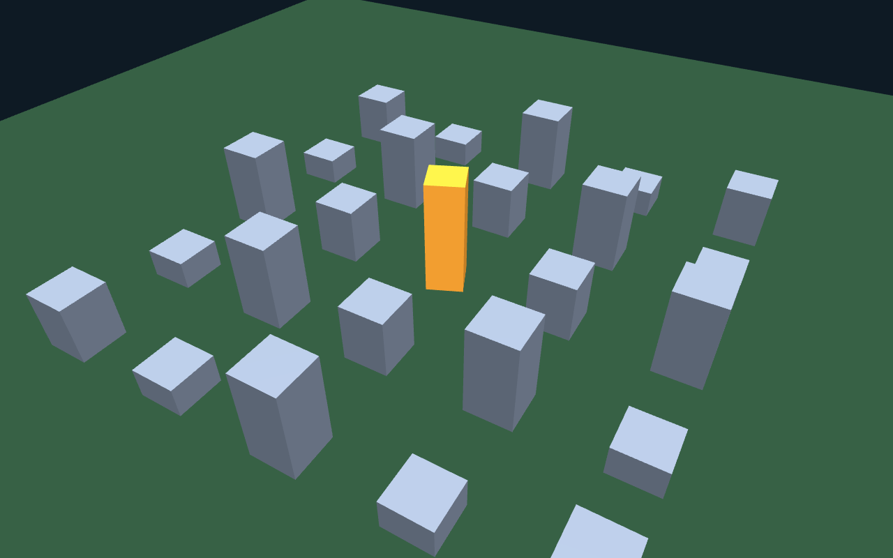
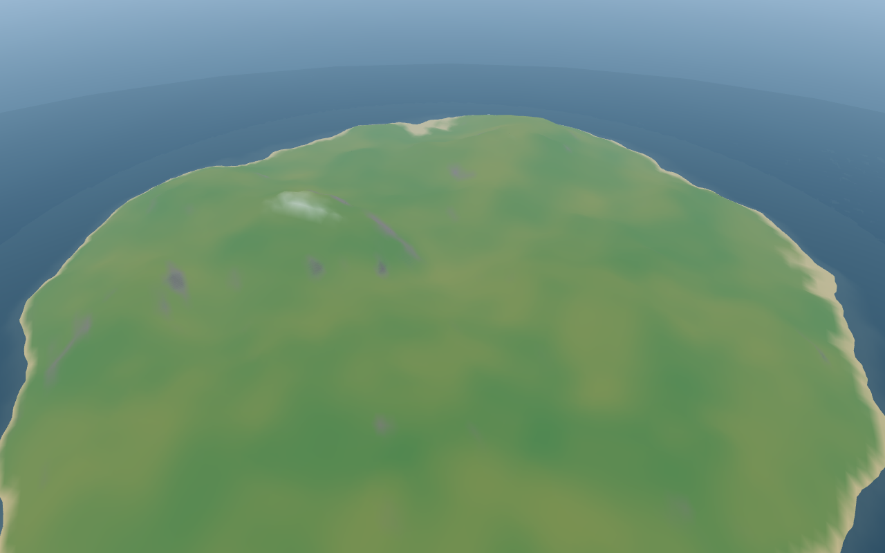
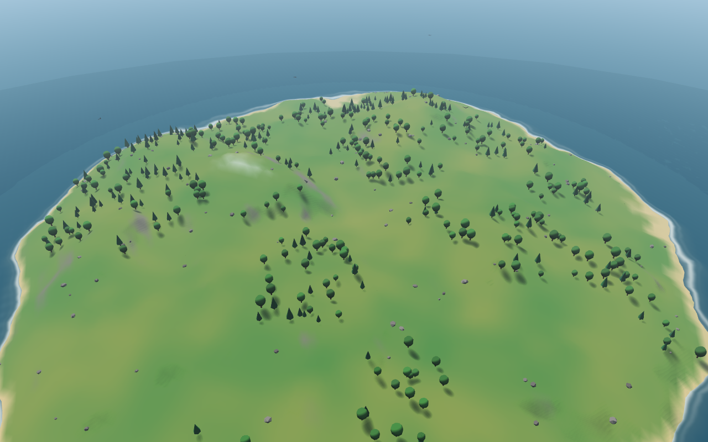
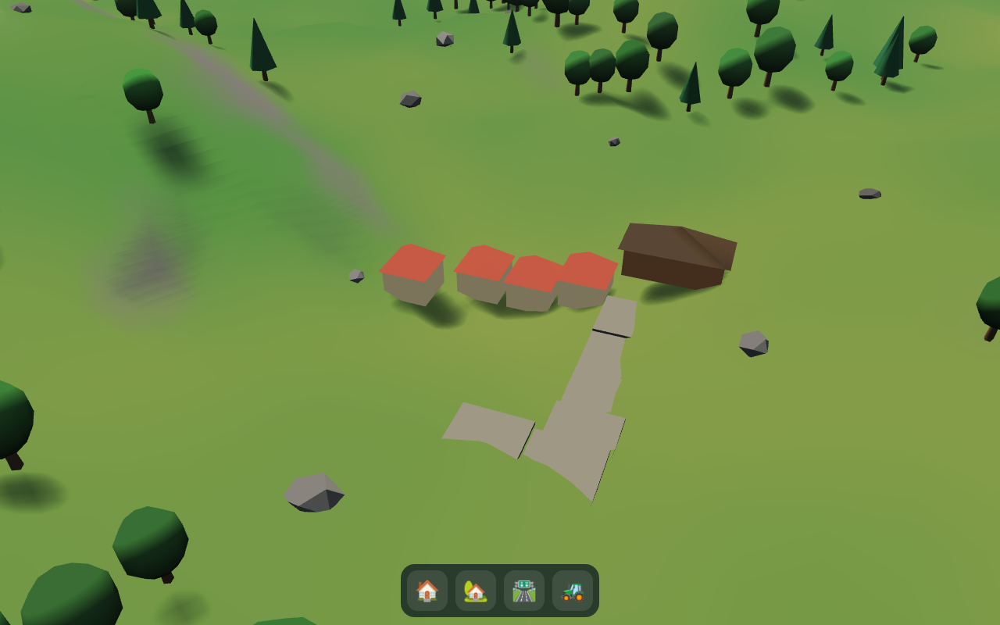
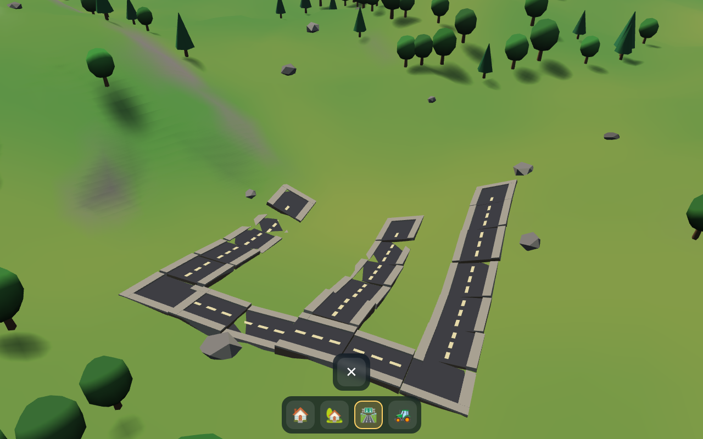

# LivingCityEngine

A modular, mobile-first city simulation engine built with **TypeScript**,
**Babylon.js**, and **Vite**.

Project vision and standards live alongside the code:

- [`GAME_DESIGN.md`](GAME_DESIGN.md) — vision, core fantasy, gameplay loop
- [`ARCHITECTURE.md`](ARCHITECTURE.md) — system layers and communication rules
- [`ROADMAP.md`](ROADMAP.md) — development phases
- [`AGENTS.md`](AGENTS.md) / [`AI_STUDIO.md`](AI_STUDIO.md) — AI studio workflow and coding rules

## Live preview

Latest `main` build, deployed via GitHub Pages:
**<https://sassydezz.github.io/LivingCityEngine/>** — works on mobile browsers.

## Quick start

```bash
npm install
npm run dev
```

Then open the printed URL. Full instructions, project structure, and
Sprint 1 design decisions: **[docs/SETUP.md](docs/SETUP.md)**.

## Progress

| Milestone | |
| --- | --- |
| v0.1.0 Foundation |  |
| v0.1.5 World Prototype |  |
| v0.2.0 Living World |  |
| v0.3.0 Construction |  |
| v0.4.0 Road Network v2 |  |

## Status

**Sprint 4 Phase A–C — Road Network v2** (v0.4.0, current):

- ✅ Auto-connecting road pieces: straights, corners, tees, crossroads form as you draw
- ✅ Sidewalks, crosswalk corner nubs, and dashed lane markings on every piece
- ✅ Terrain conformity: pieces tilt to the smoothed terrain gradient; earth embankment sides
- ✅ Roads cross/extend existing roads (intersections by drawing through)
- ✅ Smooth drag preview: continuous ribbon with endpoint dots (🟢══🟢), red tiles mark blockers
- ✅ Staggered pop-in along committed paths; audio cue hooks (`audio:cue` events)
- ✅ `RoadNetwork` graph with BFS pathfinding — the citizen/traffic foundation (unit-tested)

**Sprint 3 — Construction System** (v0.3.0, complete):

- ✅ Terrain-aware build grid (precomputed buildability: height band + slope)
- ✅ Ghost building preview with green/red validity highlighting
- ✅ Building rotation (footprint-aware for rectangular buildings)
- ✅ Road drawing with L-shaped grid snapping
- ✅ Bulldozer with shrink-out animation
- ✅ Pop-in build animation; vegetation clears under new construction
- ✅ Touch-first HUD (DOM toolbar, thumb-sized targets, safe-area aware)
- ✅ Data-driven building catalog (`gameplay/buildings/BuildingCatalog.ts`)

**Sprint 2 — Living World** (v0.2.0, complete):

- ✅ Instanced vegetation: clustered forests (round + pine trees), rocks, bushes — 4 draw calls total
- ✅ Shoreline foam hugging the coast, driven by a generated shore mask (no textures downloaded)
- ✅ Drifting clouds that glow warm at sunset and dim at night
- ✅ Night sky: procedural starfield and a low moon over the horizon
- ✅ Ambient birds gliding over the island by day
- ✅ Water detail: per-pixel ripples and sun glints, distance-faded to prevent aliasing
- ✅ Warm, saturated "cozy" palette pass across terrain, sky, and water

**Phase 2 — World Prototype** (complete):

- ✅ Procedural island terrain (seeded noise, vertex-color biomes: sand/grass/rock/snow)
- ✅ Animated ocean with GPU wave shader and shoreline transparency
- ✅ Day/night cycle: orbiting sun, moonlit nights, dawn/dusk palettes
- ✅ Gradient sky dome, distance fog, terrain shadows
- ✅ City-builder camera: orbit/pan/zoom with touch + pinch, map bounds
- ✅ Demo URL params: `?tod=` (time of day), `?daylen=`, `?seed=`

**Phase 1 — Foundation** (complete): TypeScript (strict) + Vite,
tree-shaken Babylon.js, layered architecture (`core` / `rendering` /
`world` / `simulation` / `gameplay` / `ui`), `GameEngine` /
`SceneManager` / typed `EventBus`, mobile-first defaults, GitHub Pages
auto-deploy.

No gameplay systems yet — by design. See [`ROADMAP.md`](ROADMAP.md) for what comes next.
